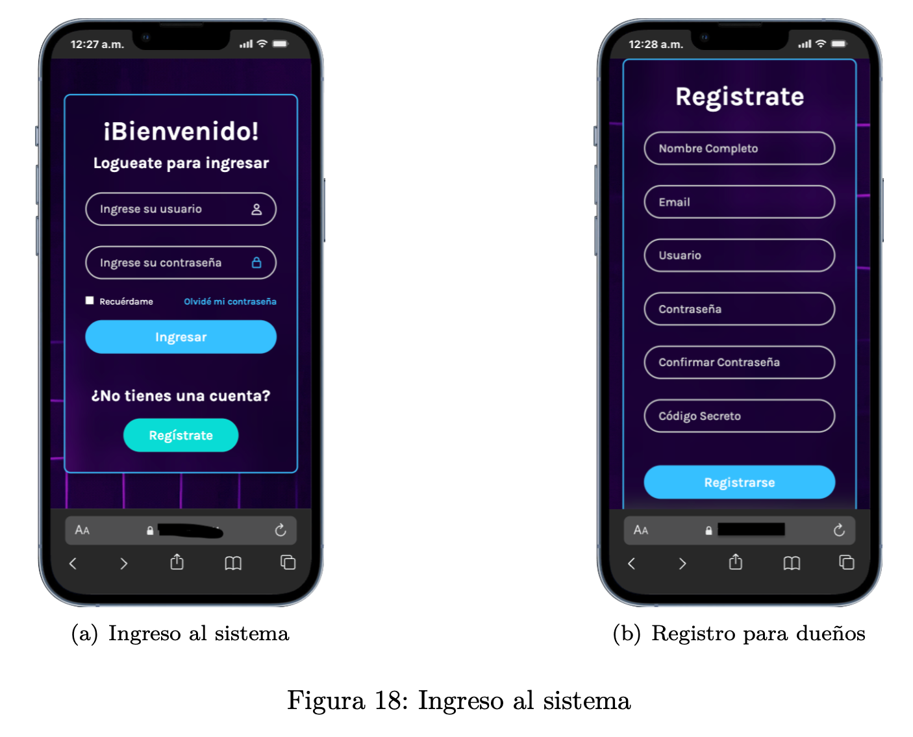
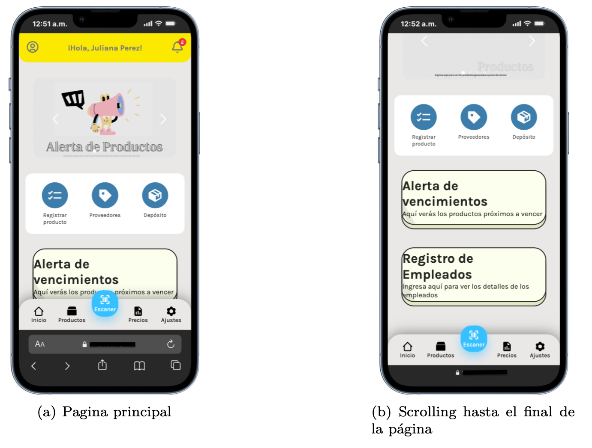
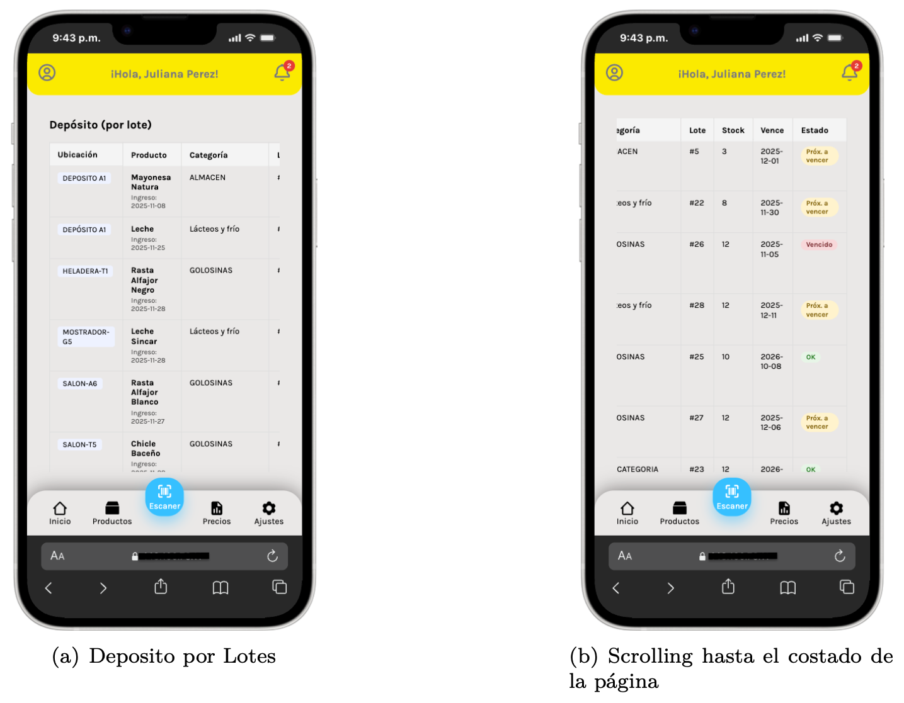
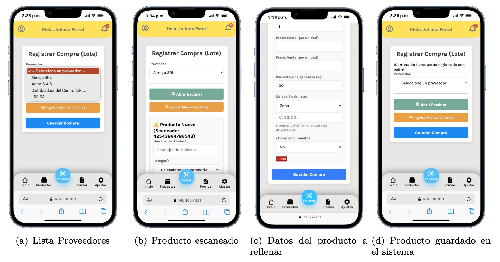
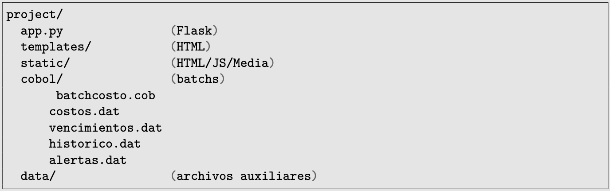
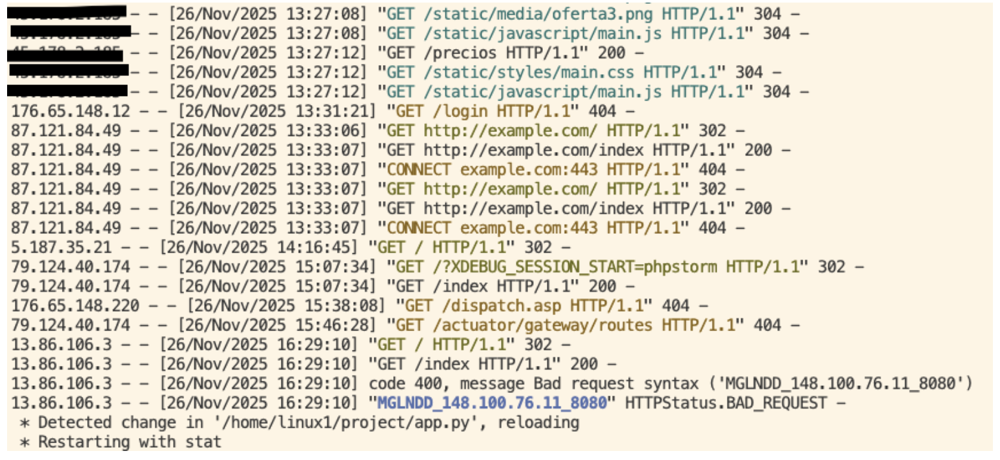

# Small Business Management: Hybrid Kiosk System on IBM LinuxONE

-blue)

Inventory and sales management system for retail kiosks deployed on **IBM LinuxONE (s390x)**. It combines the agility of a modern web interface with the robustness of legacy batch processing.

## 🚀 Hybrid Architecture

The system manages inventory using two paradigms:
1.  **Online (Real-time):** Python + Flask handle the mobile interface, barcode scanning, and direct transactions to the containerized **IBM Db2** database.
2.  **Batch (Back-office):** A pure **COBOL** module processes large volumes of data for average cost calculation, expiration detection, and historical data generation.

### 🔄 Integration Flow (The "Zero SQL" Approach)
Due to compilation constraints in the s390x environment (GnuCOBOL without Enterprise precompiler), an integration based on flat file exchange was implemented, simulating a classic mainframe environment:

1.  **Extraction:** Python extracts data from Db2 and generates `costos.dat` and `vencimientos.dat`.
2.  **Processing:** The COBOL program (`batchcosto.cbl`) reads the sequential files, applies business logic (profit rules, alerts), and generates `historico.dat` and `alertas.dat`.
3.  **Load:** Python reinjects the processed results into Db2 for frontend visualization.

## ✨ Key Features

* **Mobile Scanning:** Real-time price and stock lookup using the mobile camera (QuaggaJS).
* **FEFO Logic (First Expired, First Out):** The system automatically deducts the batch with the nearest expiration date when a sale is made.
* **Smart Alerts:** Automatic detection of products nearing expiration with "Combo Offer" suggestions to clear stock.
* **Enterprise Infrastructure:** Deployed on **IBM LinuxONE Community Cloud** with Db2 in Docker.

## 🛠 Tech Stack

* **Frontend:** HTML5, CSS3, JavaScript (QuaggaJS).
* **Backend API:** Python 3.10, Flask.
* **Batch Processing:** COBOL (GnuCOBOL).
* **Database:** IBM Db2 Community Edition (Dockerized).
* **OS:** Ubuntu Server 20.04 (s390x architecture).

## 📸 Screenshots

## 📱 Mobile UI
*Mobile-first* design optimized for kiosk operators.

| Access & Security | Main Dashboard |
|:---:|:---:|
|  |  |
| **Secure Login & Registration** | **Dashboard & Alerts** |

| Stock Management (FEFO) | Purchase Registration |
|:---:|:---:|
|  |  |
| **Batch & Expiration View** | **Stock Entry & Scanner** |

---

## 🏗️ Architecture & Backend

### Project Structure (Hybrid)
This demonstrates the integration of two worlds. The `cobol/` folder contains the batch logic (`batchcosto.cbl`) and exchange files (`costos.dat`, `historico.dat`), coexisting with the Flask application (`app.py`).

### 🛡️ Security & Real Logs
The system was deployed in a production environment exposed to the internet. Logs evidence the handling of real requests and the rejection of unauthorized access attempts (bots).

---
*(Versión en Español abajo / Spanish Version below)*

# Small Business Management: Hybrid Kiosk System on IBM LinuxONE

-blue)

Sistema de gestión de inventario y ventas para kioscos minoristas desplegado en **IBM LinuxONE (s390x)**. Combina la agilidad de una interfaz web moderna con la robustez del procesamiento batch legacy.

## 🚀 Arquitectura Híbrida

El sistema resuelve la gestión de stock utilizando dos paradigmas:
1.  **Online (Real-time):** Python + Flask manejan la interfaz móvil, el escaneo de códigos de barras y las transacciones directas a la base de datos **IBM Db2** containerizada.
2.  **Batch (Back-office):** Un módulo **COBOL** puro procesa grandes volúmenes de datos para cálculo de costos promedio, detección de vencimientos y generación de históricos.

### 🔄 Flujo de Integración (The "Zero SQL" Approach)
Debido a limitaciones de compilación en el entorno s390x (GnuCOBOL sin precompilador Enterprise), se implementó una integración basada en intercambio de archivos planos, simulando un entorno mainframe clásico:

1.  **Extracción:** Python extrae datos de Db2 y genera `costos.dat` y `vencimientos.dat`.
2.  **Procesamiento:** El programa COBOL (`batchcosto.cbl`) lee los secuenciales, aplica lógica de negocio (reglas de ganancia, alertas) y genera `historico.dat` y `alertas.dat`.
3.  **Carga:** Python reinyecta los resultados procesados en Db2 para visualización en el frontend.

## ✨ Features Principales

* **Escaneo Móvil:** Consulta de precios y stock en tiempo real usando la cámara del celular (QuaggaJS).
* **Lógica FEFO (First Expired, First Out):** El sistema descuenta automáticamente el lote con vencimiento más próximo al realizar una venta.
* **Alertas Inteligentes:** Detección automática de productos próximos a vencer con sugerencia de "Combos Oferta" para liquidar stock.
* **Infraestructura Enterprise:** Despliegue en **IBM LinuxONE Community Cloud** con Db2 en Docker.

## 🛠 Tech Stack

* **Frontend:** HTML5, CSS3, JavaScript (QuaggaJS).
* **Backend API:** Python 3.10, Flask.
* **Batch Processing:** COBOL (GnuCOBOL).
* **Database:** IBM Db2 Community Edition (Dockerized).
* **OS:** Ubuntu Server 20.04 (s390x architecture).

## 📸 Screenshots

## 📱 Interfaz Móvil (Mobile UI)
Diseño *mobile-first* optimizado para operarios de kiosco.

| Acceso y Seguridad | Panel Principal |
|:---:|:---:|
|  |  |
| **Login Seguro & Registro** | **Dashboard & Alertas** |

| Gestión de Stock (FEFO) | Registro de Compras |
|:---:|:---:|
|  |  |
| **Visualización por Lotes y Vencimientos** | **Ingreso de Mercadería & Escáner** |

---

## 🏗️ Arquitectura & Backend

### Estructura del Proyecto (Híbrido)
Aquí se evidencia la integración de dos mundos. La carpeta `cobol/` contiene la lógica batch (`batchcosto.cbl`) y los archivos de intercambio (`costos.dat`, `historico.dat`), conviviendo con la aplicación Flask (`app.py`).

### 🛡️ Seguridad y Logs Reales
El sistema fue desplegado en un entorno productivo expuesto a internet. Los logs evidencian el manejo de peticiones reales y rechazo de intentos de acceso no autorizados (bots).

